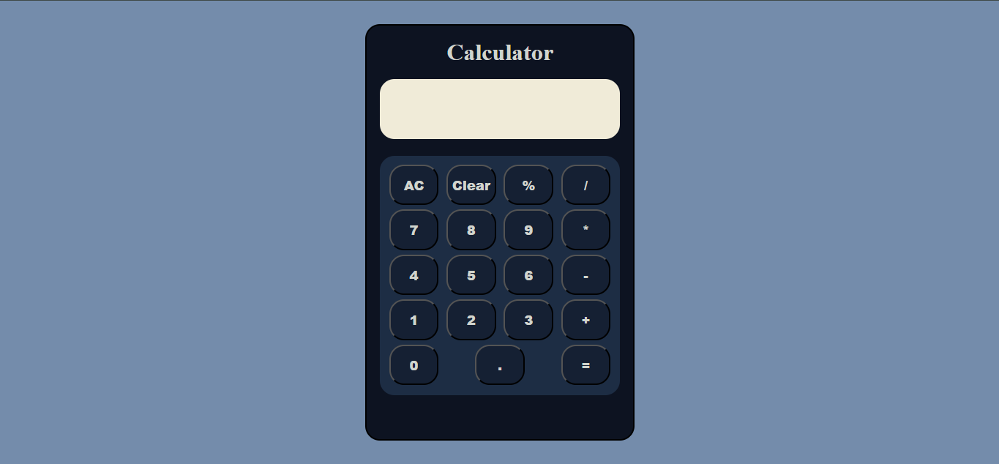

# Calculator Web Application

## Description

This is a simple web-based calculator built using HTML, CSS, and JavaScript. It can perform both decimal and integer calculations, providing a user-friendly interface for basic arithmetic operations.

## Features

- Addition, subtraction, multiplication, and division operations.
- Handles both integer and decimal calculations.
- Clear button to reset the calculator.
- Responsive design for use on various devices.


## Screenshots



## Technologies Used

- **HTML:** Structure of the calculator.
- **CSS:** Styling for the calculator.
- **JavaScript:** Functionality for performing calculations.

## Usage

1. Clone the repository:

    ```bash
    git clone https://github.com/pranabdwibedi/CalCulator.git
    ```

2. Navigate to the project directory:

    ```bash
    cd calculator
    ```

3. Open `index.html` in your browser to use the calculator.

## Code Explanation

### HTML

The HTML file contains the structure of the calculator, including buttons for digits, operators, and functions like clear and equals.

### CSS

The CSS file provides the styling for the calculator, ensuring it is visually appealing and responsive.

### JavaScript

The JavaScript file contains the logic for the calculator, including event listeners for button clicks and functions to perform arithmetic operations.

```javascript
// Example function for addition
function add(a, b) {
    return a + b;
}
```

## Contributing

1. Fork the repository.
2. Create a new branch:

    ```bash
    git checkout -b feature-branch
    ```

3. Make your changes and commit them:

    ```bash
    git commit -m "Description of changes"
    ```

4. Push to the branch:

    ```bash
    git push origin feature-branch
    ```

5. Open a pull request.


## Contact

If you have any questions or suggestions, feel free to reach out at [pranabkumardwibedi@gmail.com].